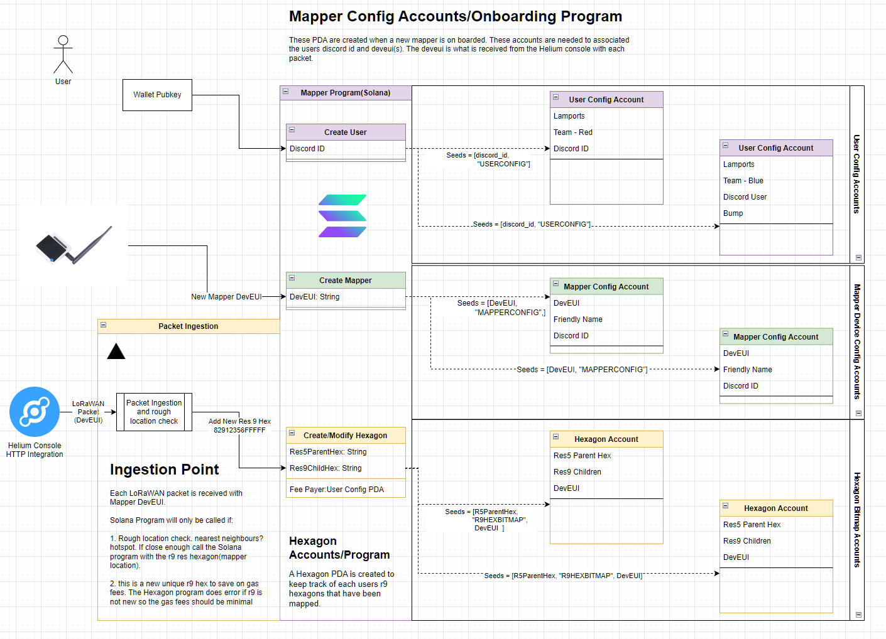

# leaderboard
This a proof of concept on-chain leaderboard for Helium mapper devices. It is a Solana Anchor program that exposes a few different instructions to keep track of mappers and Uber H3 hexagons they have mapped.

A working prototype on the Solana devnet is running and the instructions can be invoked from a discord server setup as a demo.

## Create User Instruction( /join )
Invoked with a discord ID this instruction assigns the discord user to a team and creates a User Config PDA. This account is the main users account that they will have to fund for mapping purposes. 

## Create Mapper Instruction( /add )
This instruction creates a PDA with the mappers Device EUI as part of the seed. The account records the devEUI, mapper friendly name, and the user's discord ID. The discord ID here allows the user to run multiple mapper devices on the same team and funded from the same account.

## Create/Modify Hexagon Instruction ( /fund )
The Hexagon accounts are used to record hexagons that have been covered by a mapper. The accounts are created with a parent resolution 5 hexagon and mapper deveui as the seeds. These accounts store resolution 9 hexagons that the mapper has successfully covered as a bitmap. This instruction is automatically called from the Helium console ingestion point.

The Hexagon accounts are also used to keep track of an individual hotspot's coverage. The idea is any interested party can issue the /fund command with a hotspots address which will create the Hexagon PDA. This allows anyone to fund a hotspot to be mapped.

